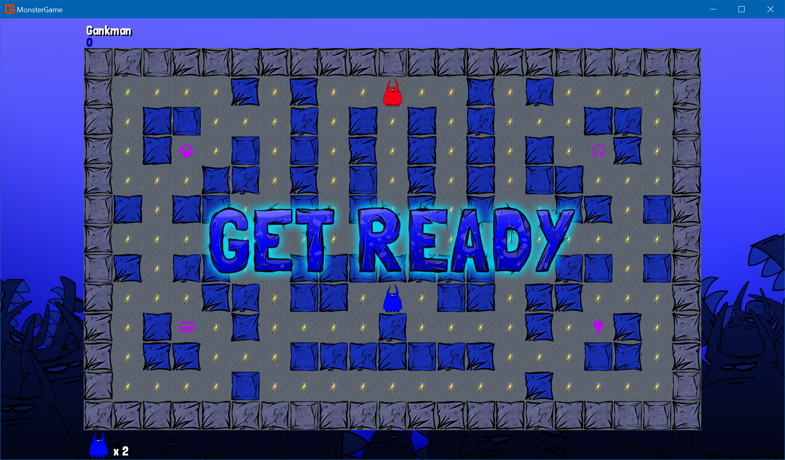

# Chomp

A sample game written with MonoGame that targets UWP, cross-platform (Windows/Mac/Linux) and Android.  Xbox Live code is included, however the title id and other config is not.  The Xbox Live config for this project is no longer running, but you can at least see how the code works.

## Requirements

* [MonoGame v3.7](http://www.monogame.net/downloads/) (or higher)
* [Visual Studio 2017](https://visualstudio.microsoft.com/) (or higher)

## Credits/Special Thanks

* [Joey Buczek](https://github.com/joeybuczek) - Art
* [David Wallimann](https://www.davidwallimann.com/) - Music & Sound
